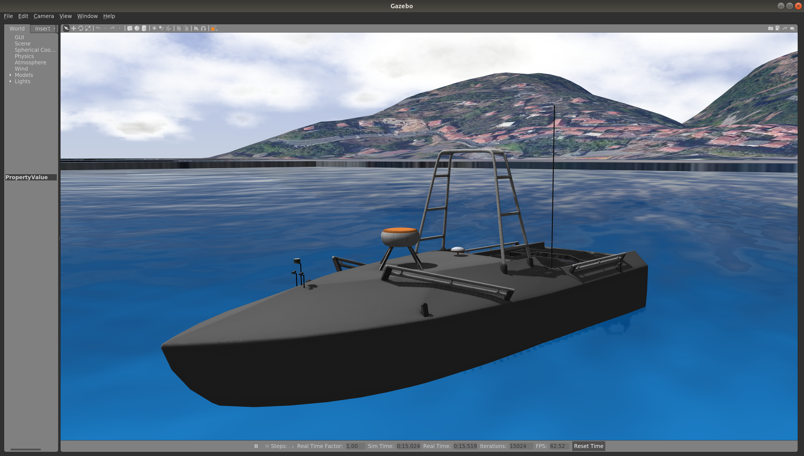

# Virtual Ocean Robotics Challenge (VORC)

This repository is the home to the source code and software documentation for
the Virtual Ocean Robotics Challenge.
[Challenge documentation](https://github.com/osrf/vorc/wiki) is
available on the project wiki, including links to the public website and
documentation of the tasks and technical specifications.

This is an active development project. We are adding and improving things all
the time. The project contains a simulation foundation, including a maritime
environment and description of the platform. It is intended as a first step for
teams entering into maritime competitions.




## Getting Started

 * Watch the [Release 1.0 Highlight Video](https://www.youtube.com/watch?v=j7hQZLJQ8Y4)
 * The [VORC Wiki](https://github.com/osrf/vorc/wiki) provides documentation
 and tutorials.
 * Use [community.gazebosim.org](https://community.gazebosim.org/c/projects/vorc/9)
 for general-purpose discussions about VORC.
 * This project relies on other projects. [Gazebo](http://gazebosim.org/),
 [ROS](http://ros.org) and [VRX](http://github.com/osrf/vrx) are project
  dependencies.
 * The instructions assume a basic familiarity with the ROS environment and Gazebo.  If these tools are new to you, we recommend starting with the excellent [ROS Tutorials](http://wiki.ros.org/ROS/Tutorials)
 * For technical problems, please us the [project issue tracker](https://github.com/osrf/vrx/issues) to describe your problem or request support.

## Reference

If you use the VORC/VRX simulation in your work, please cite our summary
publication, [Toward Maritime Robotic Simulation in Gazebo](https://wiki.nps.edu/display/BB/Publications?preview=/1173263776/1173263778/PID6131719.pdf):

```
@InProceedings{bingham19toward,
  Title                    = {Toward Maritime Robotic Simulation in Gazebo},
  Author                   = {Brian Bingham and Carlos Aguero and Michael McCarrin and Joseph Klamo and Joshua Malia and Kevin Allen and Tyler Lum and Marshall Rawson and Rumman Waqar},
  Booktitle                = {Proceedings of MTS/IEEE OCEANS Conference},
  Year                     = {2019},
  Address                  = {Seattle, WA},
  Month                    = {October}
}
```

## Contributing

We are starting simple with the important fundamental aspects of the robot and
environment, but will rely on the community to develop additional functionality
around their particular use cases.

If you have any questions about these topics, or would like to work on other
aspects, please contribute. You can contact us directly (see below), submit an
[issue](https://github.com/osrf/vorc/issues) or, better yet, submit a
[pull request](https://github.com/osrf/vorc/pulls/)!

## Contacts

 * Carlos Aguero <caguero@openrobotics.org>
 * Brian Bingham <bbingham@nps.edu>
